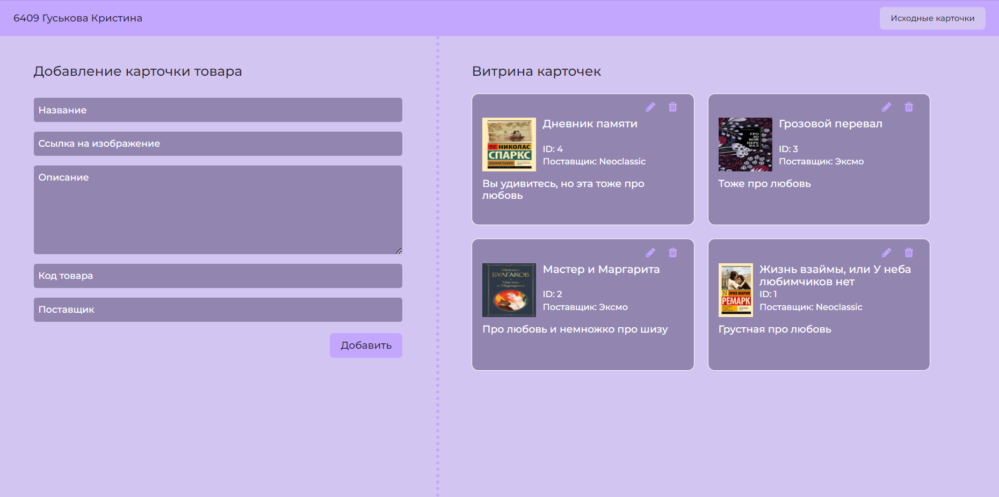
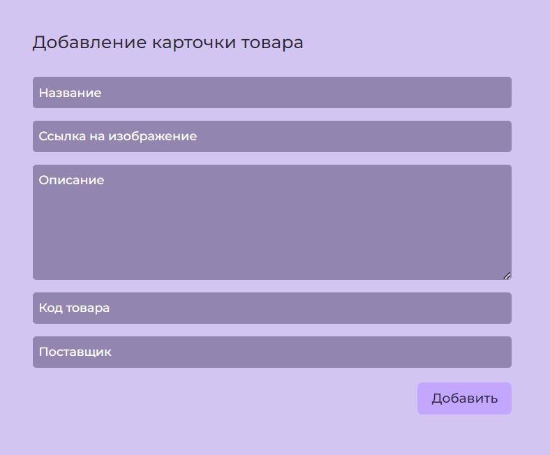
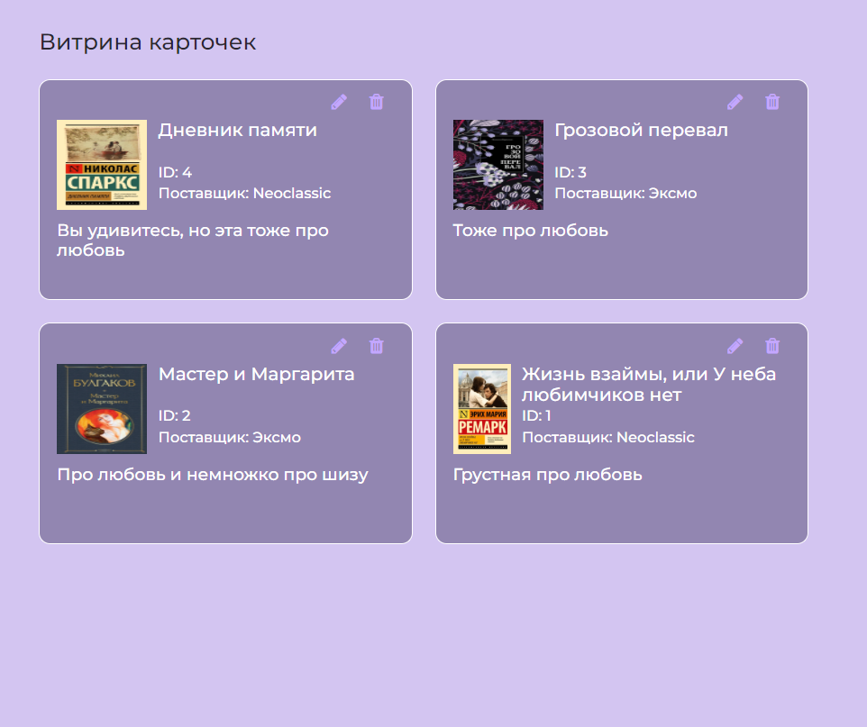
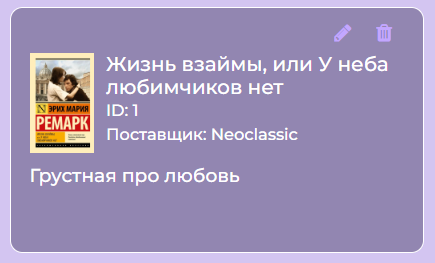

# Админка карточек(товаров)
## О проекте
Данный проект позволяет администрировать карточки товаров: создавать, редактировать, удалять.

Так выглядит страница в целом:

При нажатии на кнопку "Исходные карточки" подгружаются заготовленные карточки для того, чтобы можно было быстро и наглядно оценить работоспособность админки:

Слева отображена форма для добавления/редактирования карточки (заголовок и кнопка меняются в зависимости от действия) со всеми необходимыми полями. В данной форме нельзя создать точную копию существующей карточки, карточки с повторяющимся Id или отрицательным Id, а также нельзя отправить пустую форму:

Справа отображена витрина карточек, карточки отображаются в порядке "от самых новых к самым старым" для удобства пользователя:

Каждая карточка имеет фото, название, id, поставщика и описание, а также две кнопки для редактирования карточки (при этом все поля перенесутся в форму) и для удаления карточки:

## Как запустить
Предварительно должны быть установлены git и nodejs(версия lts 16 и выше)
- install node.js v16>(npm v7.x>) (https://nodejs.org/en/download/)
- install git(https://git-scm.com/downloads)

Далее:
- Скачиваем проект к себе
- Заходим в папку с проектом и открываем там терминал
- `npm i` - установка зависимостей(появляется папка node-modules и файл package-lock.json)
- Для установки сервера прописываем `npm install --save-dev json-server`
- Для запуска сервера - `npx json-server --watch db.json`, где `db.json` - файл с базой данных
- Наводим на файл `index.html` и через правую кнопку мыши нажимаем `Open with Live Server`, после этого видим, как наш проект(сайт) отображается в браузере по адресу `http://127.0.0.1:5500`